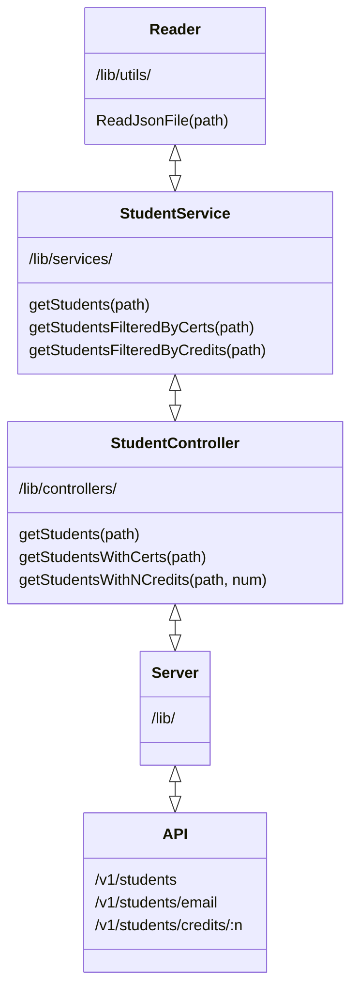

# CodeChallenge
Repositorio de práctica del curso en NodeJS by InnovaacciónVirtual.

El repositorio contiene la solución a un reto que consiste en tomar una db en formato JSON y escribir el código necesario para satisfacer los siguientes requerimientos:

* Habilitar un endpoint para consultar todos los estudiantes con todos sus campos.
* Habilitar un endpoint para consultar los emails de todos los estudiantes que tengan certificación `haveCertification.`
* Habilitar un endpoint para consultar todos los estudiantes que tengan `credits` mayor a 500.

### DEPENDENCIAS

Se necesitan las dependencias **JEST**, para pruebas de unidad y **express** para el servidor API.
Las dependencias son instalables de la siguiente forma: `npm install --save-dev jest` y `npm install --save express`

### DISEÑO DE LA SOLUCIÓN

La separación de clases y directorios nos ayuda a tener una estructura pero también una separación de responsabilidades. 
- Services: clases para aplicar lógica que necesitemos usando modelos.
- Utils: clases auxiliares.
- Controllers: Uso de exclusivo de services.

## FUNCIONAMIENTO

El API responde a peticiones GET, por lo que las consultas se pueden hacer desde cualquier navegador web de la siguiente forma:

- Iniciar el servidor: `npm run server`
- En el navegador introducir la dirección: `localhost:3000/v1/students` para obtener el registro total de estudiantes.

- Introducir en el navegador la dirección: `localhost:3000/v1/students/email` para obtener los emails de los usuarios que tienen una certificación.

- Introducir en el navegador la dirección: `localhost:3000/v1/students/credits/900` para obtener los registros de usuarios con créditos mayores a cierto número. Para estudiantes con créditos mayores a 500, agregar 500, para estudiantes con creditos mayores a 900, agregar 900 al final de la URL y lo mismo con cualquier cantidad de créditos.

